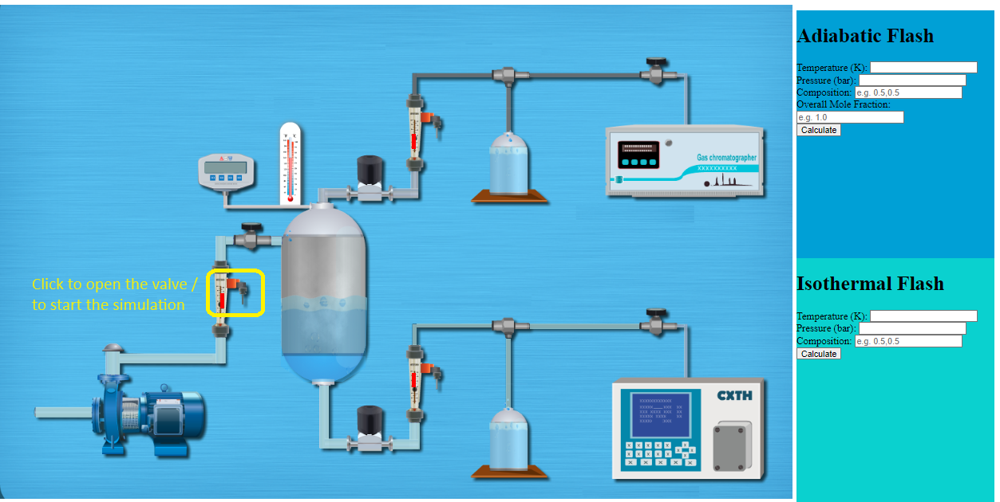
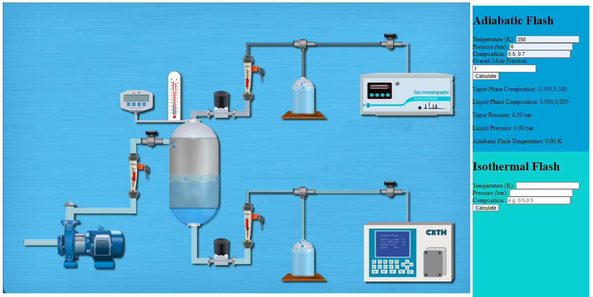
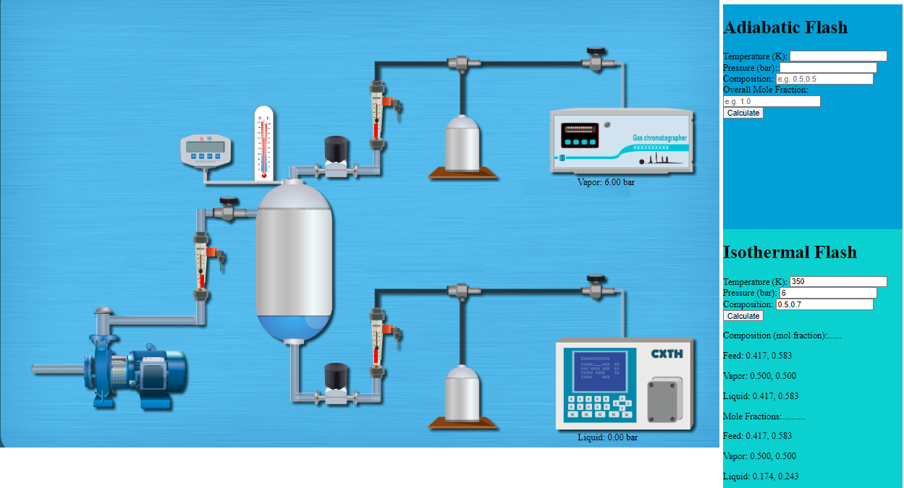

## Procedure

1. Click on the Experiment tab SIMULATON will open the workspace
                              
2. To start the simulation , you have to click to open the valve, shown in picure bellow. 
 
3. Wait till the simulation completed  
4. To calculate Adiabatic Flash, input the parameters and press Calculate button, shown in picture bellow  
  
5. To calculate Isothermal Flash, input the parameters and press Calculate button, shown in picture bellow  
                              
             
                            
         
