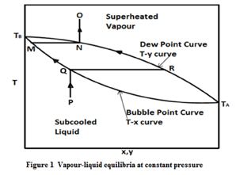
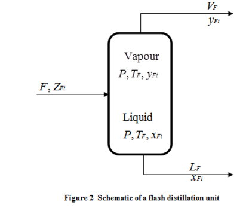

## Theory

Introduction

<!-- Write the section content inside a paragraph element, You can also include images with &lt;img&gt; tag -->

VAPOUR-LIQUID EQUILIBRIUM (VLE)

 
Separation of a mixture by distillation is based on the equilibrium distribution of the components between the liquid phase and the vapour phase. Knowledge of vapour-liquid equilibrium is therefore essential for understanding the principles of distillation. A phase equilibrium diagram is essential for the relationship between the mole fraction of a component in the vapour and liquid phases. The equilibrium is defined for varying temperatures at constant pressure or varying pressure at constant temperature.

 

Figure.1 is the phase-equilibrium diagram for a binary mixture system where x, y refers to the mole fraction of the more volatile component in the liquid phase and vapour phase respectively. The temperature raised to its boiling point and is plotted with respect to the liquid composition x, then we get the "bubble point curve" and if we plot it again with respect to the vapour composition y then we get the "dew point curve". In the diagram P represents the sub-cooled liquid which is heated at constant pressure to point Q, where the first bubble of vapour appears. The vapour appeared has the composition, represented by point R which is significantly rich with the less volatile component than in the initial state. The heating process is continued beyond point Q where the temperature rises causing the amount of vapour to increase and the amount of liquid to decrease. During this process, compositions of vapour and liquid phases change as indicated by paths RN and QM until the dew point is reached at point N,where the last droplet of liquid disappear. The line TB-M-Q-TA in the figure.1 is the bubble point curve and TB-N-R-TA is the dew point curve.

<b>RAOULT'S LAW -</b> Raoult's law describes the vapour liquid equilibrium of ideal solution. For an ideal solution the partial pressure of a component is equal to the product of itsmole fraction in the liquid phase and its vapour pressure at the prevailing conditions. It can be written as

$$P_A* = x_AP_A$$
 $$P_B** = x_BP_B$$
 `where,`
 $$P_A*, P_B*= \ Partial \ pressure \ of \ component \ A \ and \ B
 $$x_A, x_B = \ Mole \ fraction \ of \ component \ A \ and \ B \ in \ the \ liquid \ phase$$
 $$P_A, P_B = \ Vapour \ pressures \ of \ component \ A \ and \ B \ at \ system \ temperature$$
 Also,
 $$P_A*= y_AP$$
 $$P_B*= y_BP$$
 $$Where \ y_A, y_B = \ Mole \ fraction \ of \ component \ A \ and \ B \ in \ the \ vapour \ phase$$
 P = Total pressure

 
According to Dalton's law the total pressure is equal to the sum of the partial pressures. Therefore,

 $$P =P_A*+P_B*$$
 = $$x_AP_A+x_BP_B$$

 
The vapour pressure of pure components can be obtained either from charts or the use of equation. Antoine equation given below is widely used for this. This is given below

$$In \ P_i= A_i - B_i/ C_i + T$$
 Where `A_i, B_i and C_i` are constant for component i.

<b>RELATIVE VOLATILITY :</b> Relative volatility is the concentration ratio of A to B in the vapour phase divided by the same ratio in the liquid phase. Relative volatility is usually denoted as α. For binary mixture  
α = y/(1-y) / x(1-x)  
$$P_A/ P_B \ (Ratio \ of \ vapour \ pressure \ of \ A \ and \ B)$$  
α is a dimensionless quantity. When α = 1, the separation would be impossible under the given condition because the composition of the liquid and the vapour phase are the same (azeotrope).When α > 1, separation by distillation becomes progressively easier.

                            
<b>DIFFERENT WAYS OF FLASH DISTILLATION :</b> The separation of a feed mixture in a flash drum can be carried out by two different ways (Luyben, 1990), and they are described as follows 
The temperature of the liquid feed is increased to a certain temperature which lies between the bubble point temperature and the dew point temperature of that feed at a specified constant pressure, 
By lowering the pressure on the feed stream. 
The partial vaporisation of a multicomponent feed mixture is commonly conducted by reducing the pressure on the feed stream rather than by heating the feed at constant pressure. However, the two general methods referred for flash calculation are as follows: 
<ol><li>Isothermal flash</li>
<li>Adiabatic flash.</li></ol>
 

<b>ISOTHERMAL FLASH</b>

The isothermal flash is commonly used in the single stage separation process.The flash temperature TF and pressure P. The total flow rate F and composition(xi) of the feed. The name given as isothermal flash because the temperature of the contents in the flash drum as well as the vapour and liquid streams formed by the flash are the same temperature. The flash temperature may not be equal to the feed temperature prior to its flashing. An isothermal flash process can be mathematically described by the independent equation required to describe by the following equation.

<b>
 Equilibrium relationship</b>
  
 $y_{Fi}=K_{Fi}x_{Fi} ( i= 1,2,.....C)$$ 
$$\sum_{i=1}^c{ y_{Fi}}=1$$

$$\sum_{i=1}^c{ x_{Fi}}=1$$

 

Material balances: 
$$FZ_{Fi} = V_Fy_{Fi} + L_{F}x_{Fi}$$ 
Where,`K_(Fi)` represents the equilibrium coefficient of component i, `y_Fi` and `x_Fi` are the composition of component i in the produced vapour and liquid streams.  
`Z_(Fi)` the feed composition of component i, `L_F` and `V_F` the flow rates of liquid and vapour streams. Equation 13 can be extended to: 
$$Fsum_(i=1)^c Z_{Fi}=V_Fsum_(i=1)^c y_{Fi}+L_Fsum_(i=1)^c x_{Fi}$$  
$$F=V_F+L_F$$  
$$x_{Fi}=Z_{Fi}/(L_F/F+V_FK_{Fi}/F)$$  
$$x_{Fi}=Z_{Fi}/((1-V_F/F)+V_FK_{Fi}/F)$$  
$$x_{Fi}=Z_{Fi}/(1-theta(1-K_{Fi}))$$ &nbsp Where `theta=V_F/F`  
Now, we consider,  
$$f(theta)=sum_(i=1)^cZ_{Fi}/[[1-theta(1-K_{Fi})]]-1$$  
Positive value of θ means the vaporisation occurs, whereas zero value indicatesno vaporisation.

 

     
 
